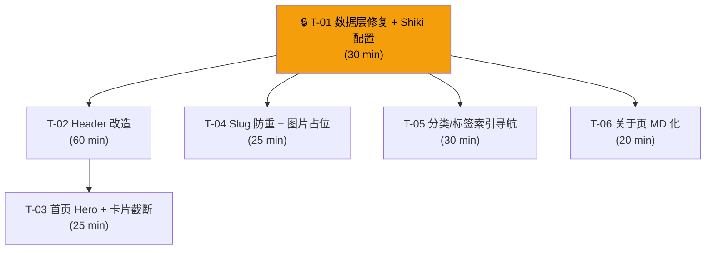

# 博客核心骨架 — 开发任务计划

## 1. 任务概览

**总任务数**：6 个
**预计总工时**：190 分钟（约 3.2 小时）
**开发方法**：TDD — 每个任务按 RED → GREEN → REFACTOR 循环执行

**关键标注**：
- 🔒 阻塞任务：被多个任务依赖，建议优先完成
- ⚠️ 风险任务：技术难度高，可能需要额外时间

### 依赖关系图



### 可并行任务组

| 并行组 | 任务 | 说明 |
|--------|------|------|
| G1 | T-04, T-05, T-06 | 均仅依赖 T-01，互不依赖，可并行执行 |
| G2 | T-03 | 依赖 T-02，与 G1 并行 |

### 已有实现（不需要开发）

以下 AC 在现有代码中已完整实现，本次不生成开发任务：

| AC 编号 | 验收标准 | 已实现位置 |
|---------|---------|-----------|
| AC-006 | 归档页按年月分组 | `archive.astro` |
| AC-008 | 首次访问主题跟随系统 | `BaseLayout.astro` 内联 script |
| AC-013 | Sitemap 自动生成 | `@astrojs/sitemap` 集成 |
| AC-014 | GitHub Actions 自动部署 | `.github/workflows/deploy.yml` |
| AC-015 | 空文章状态 | `PostList.astro` |
| AC-018 | 无标签文章不显示标签区 | `BlogPostLayout.astro` |
| AC-021 | 代码块长行水平滚动 | `global.css` `overflow-x: auto` |
| AC-022 | Frontmatter 校验失败报错 | Zod schema 构建时校验 |
| AC-023 | 404 页面 | `404.astro` |

---

## 2. 开发任务

### 阶段 0：基础设施

**阶段完成标准**：数据层和构建配置就绪——后续所有切片依赖此阶段的产物。

---

#### Task-01 🔒：数据层修复 + Shiki 代码高亮配置

**通俗解释**：打好地基——文章分类没填就自动归"未分类"，日期显示为 YYYY-MM-DD，作者头像和简介能配置，代码块有颜色高亮。

**做什么**：
1. `content.config.ts`：category 字段从 `z.string().min(1)` 改为 `z.string().default("未分类")`
2. `date.ts`：formatDate 从 zh-CN 格式改为手动拼接 `YYYY-MM-DD`
3. `constants.ts`：新增 SITE_AVATAR、SITE_BIO 导出
4. `astro.config.mjs`：添加 markdown.shikiConfig 配置

**涉及文件**：`src/content.config.ts`、`src/utils/date.ts`、`src/utils/constants.ts`、`astro.config.mjs`

**参考**：技术方案 3.1, 3.3, 3.4, 6.1 → AC-017, AC-025, AC-026, AC-002, AC-003(Shiki)

**依赖**：无

**预估工时**：30 分钟

**验证标准**（TDD RED 阶段直接转化为测试用例）：

- [x] `category` 字段省略时，`post.data.category` 值为 `"未分类"`
  - **Given** 一篇 MD 文件 frontmatter 不含 category，**When** Astro 加载该文章，**Then** `data.category === "未分类"`
- [x] `formatDate(new Date("2026-05-10"))` 返回 `"2026-05-10"`
  - **Given** 日期对象，**When** 调用 formatDate，**Then** 返回 YYYY-MM-DD 格式，不含斜杠
- [x] `SITE_AVATAR` 和 `SITE_BIO` 从 `constants.ts` 正确导出，类型均为 string
  - **Given** import constants，**When** 读取 SITE_AVATAR 和 SITE_BIO，**Then** 值为非空字符串
- [x] 代码块渲染后 `<pre>` 内包含带颜色的 `<span>`（语法高亮生效，非纯色文本）
  - **Given** 文章含代码块 ` ```js\nconst x = 1;\n``` `，**When** 构建后打开文章页，**Then** 代码块内关键字、变量等呈现不同颜色

---

### 阶段 1：全站导航与主题

**阶段完成标准**：用户在任意设备上都能看到完整的导航菜单、一键切换深色/浅色主题、偏好被记住。

---

#### Task-02：Header 导航改造 + ThemeToggle 挂载 + 汉堡菜单

**通俗解释**：顶部导航栏补全——能看到分类/标签入口、能一键切换深色模式、手机上看菜单不挤。

**做什么**：
1. navItems 数组增加「分类」→ `/blog/category/`、「标签」→ `/blog/tag/`
2. 在导航右侧挂载 `<ThemeToggle client:load />`
3. 实现移动端汉堡菜单：`<768px` 时隐藏横向菜单，显示汉堡按钮，点击展开垂直菜单
4. 菜单展开后点击任意链接自动关闭

**涉及文件**：`src/components/Header.astro`

**参考**：技术方案 5.1 → AC-008, AC-009, AC-010, AC-011, AC-012

**依赖**：Task-01（需要 constants 中的站点标题）

**预估工时**：60 分钟

**验证标准**：

- [x] 导航栏显示完整的 5 个导航项：首页、分类、标签、归档、关于
  - **Given** 访客打开任意页面，**When** 页面加载完成，**Then** 桌面端（≥768px）导航栏横向排列全部 5 个链接 + 主题切换按钮
- [x] 点击主题切换按钮，页面深浅色即时切换
  - **Given** 当前为浅色模式，**When** 点击主题按钮，**Then** 页面立即变为深色模式（背景变深色、文字变浅色）
- [x] 关闭浏览器标签页后重新打开，主题偏好保持
  - **Given** 上次访问选择了深色模式，**When** 重新打开站点，**Then** 页面以深色模式加载（不闪烁）
- [x] 移动端（宽度 < 768px）不显示横向导航，显示汉堡图标按钮
  - **Given** 手机浏览器（375px 宽），**When** 打开页面，**Then** 导航区显示站点名和汉堡按钮，不显示导航链接列表
- [x] 点击汉堡按钮展开垂直菜单，点击任一导航链接后菜单自动关闭
  - **Given** 移动端已展开汉堡菜单，**When** 点击"分类"，**Then** 页面导航到 `/blog/category/`，菜单收起
- [x] 展开的汉堡菜单点击页面其他区域可关闭（可选）
  - **Given** 移动端已展开菜单，**When** 点击页面空白区域，**Then** 菜单收起

---

### 阶段 2：首页

**阶段完成标准**：用户打开首页看到作者头像和简介，下方是文章列表，长标题不撑破布局。

---

#### Task-03：首页 Hero 区域 + PostCard 标题截断

**通俗解释**：首页有"人"了——顶部展示作者头像和一段自我介绍，让访客知道这是谁的博客。

**做什么**：
1. `index.astro` 在 PostList 上方新增 Hero 区域：头像 + 简介
2. `PostCard.astro` 标题添加 `truncate` 或 `line-clamp-1` 类

**涉及文件**：`src/pages/index.astro`、`src/components/PostCard.astro`

**参考**：技术方案 5.2, 5.3 → AC-001, AC-002, AC-020

**依赖**：Task-02（Hero 区在 Header 下方，需要完整导航上下文验证布局）

**预估工时**：25 分钟

**验证标准**：

- [x] 首页文章列表上方显示作者头像和简介
  - **Given** `constants.ts` 配置了 SITE_AVATAR 和 SITE_BIO，**When** 访问首页 `/`，**Then** 页面顶部（导航下方、文章列表上方）显示头像图片和简介文字
- [x] 文章卡片中特长的标题显示为省略号截断
  - **Given** 存在一篇标题很长的文章，**When** 在首页渲染文章列表，**Then** 标题在一行内显示，超出部分显示省略号（`…`），列表布局不被撑破
- [x] 正常长度标题完整显示
  - **Given** 文章标题在正常长度内，**When** 在首页渲染，**Then** 标题完整显示，不截断

---

### 阶段 3：文章阅读体验

**阶段完成标准**：重复 slug 的文章构建时被拦截并报错，文章中的缺失图片显示为友好占位文字。

---

#### Task-04：Slug 唯一性校验 + 图片缺失占位

**通俗解释**：防止两篇文章"撞名"导致链接冲突，文章里引用的图片如果丢了也不会显示难看的裂图。

**做什么**：
1. `blog/[...slug].astro` 的 `getStaticPaths()` 中添加 slug 重复检测逻辑
2. `BlogPostLayout.astro` 添加内联 `<script>`：监听 `<article>` 内 `` 的 `error` 事件，替换为占位文字

**涉及文件**：`src/pages/blog/[...slug].astro`、`src/layouts/BlogPostLayout.astro`

**参考**：技术方案 6.2, 5.4 → AC-024, AC-019

**依赖**：Task-01

**预估工时**：25 分钟

**验证标准**：

- [x] 两篇文章使用相同 slug 时构建失败
  - **Given** `src/content/blog/` 下存在两篇不同文件但 slug 相同的文章（如 `a.md` 和 `a.mdx`），**When** 执行 `pnpm build`，**Then** 构建失败，错误信息包含 "Slug 重复" 和冲突的 slug 值
- [x] 所有 slug 唯一时构建成功
  - **Given** 所有文章 slug 互不相同，**When** 执行 `pnpm build`，**Then** 构建成功，无 slug 相关错误
- [x] 文章内引用的图片不存在时显示占位文字
  - **Given** 文章正文中引用了 ``（文件不存在），**When** 浏览器加载该文章页，**Then** 该位置显示文字 "图片未找到"（灰色斜体），不显示浏览器默认裂图图标
- [x] 正常存在的图片不受影响
  - **Given** 文章正文中引用了存在的图片，**When** 浏览器加载，**Then** 图片正常显示，不被 onerror 替换

---

### 阶段 4：内容发现

**阶段完成标准**：用户可以浏览所有分类和标签的总览页，空分类/标签有友好提示。

---

#### Task-05：分类/标签总览页 + 空状态处理

**通俗解释**：访客能找到按分类和标签浏览的"入口页面"，而不是只能点文章里的分类链接。空分类也不会显示空白。

**做什么**：
1. 新建 `src/pages/blog/category/index.astro`：使用 `getAllCategories()` → 渲染 `<CategoryList>`
2. 新建 `src/pages/blog/tag/index.astro`：使用 `getAllTags()` → 渲染 `<TagCloud>`
3. 修改 `[category].astro`：posts.length === 0 时显示友好提示
4. 修改 `[tag].astro`：posts.length === 0 时显示友好提示

**涉及文件**：
- `src/pages/blog/category/index.astro`（新建）
- `src/pages/blog/tag/index.astro`（新建）
- `src/pages/blog/category/[category].astro`（修改）
- `src/pages/blog/tag/[tag].astro`（修改）

**参考**：技术方案 4.1, 5.5 → AC-004, AC-005, AC-016

**依赖**：Task-01

**预估工时**：30 分钟

**验证标准**：

- [x] `/blog/category/` 页面显示所有分类及各自文章数
  - **Given** 站点至少有一篇已发布文章（含分类），**When** 访问 `/blog/category/`，**Then** 页面列出所有分类，每个分类显示名称和文章计数
- [x] `/blog/tag/` 页面显示所有标签及各自文章数
  - **Given** 站点至少有一篇已发布文章（含标签），**When** 访问 `/blog/tag/`，**Then** 页面列出所有标签，每个标签显示名称和文章计数
- [x] 点击分类进入该分类下文章列表
  - **Given** 在分类总览页，**When** 点击分类"技术笔记"，**Then** 跳转到 `/blog/category/技术笔记/`，显示该分类下所有文章
- [x] 点击标签进入该标签下文章列表
  - **Given** 在标签总览页，**When** 点击标签"Astro"，**Then** 跳转到 `/blog/tag/Astro/`，显示该标签下所有文章
- [x] 访问不存在的分类时显示友好提示
  - **Given** 没有任何文章属于分类"不存在的分类"，**When** 访问 `/blog/category/不存在的分类/`，**Then** 页面显示 "该分类下暂无文章" 提示，不显示空白页
- [x] 访问不存在的标签时显示友好提示
  - **Given** 没有任何文章包含标签"不存在的标签"，**When** 访问 `/blog/tag/不存在的标签/`，**Then** 页面显示 "该标签下暂无文章" 提示，不显示空白页

---

### 阶段 5：关于页

**阶段完成标准**：关于页内容从 Markdown 文件读取，用户编辑 about.md 即可更新关于页。

---

#### Task-06：关于页 Markdown 化

**通俗解释**：把关于页的"自我介绍"从代码里抽出来，放到一个 Markdown 文件里，以后改介绍直接改这个文件就行。

**做什么**：
1. 新建 `src/content/about.md`，写入当前关于页的 Markdown 内容
2. 修改 `src/pages/about.astro`：从直接写死的 HTML 改为 import about.md 并渲染

**涉及文件**：`src/content/about.md`（新建）、`src/pages/about.astro`（修改）

**参考**：技术方案 3.2 → AC-007

**依赖**：Task-01

**预估工时**：20 分钟

**验证标准**：

- [x] `/about/` 页面渲染 about.md 的内容
  - **Given** `src/content/about.md` 包含标题和段落，**When** 访问 `/about/`，**Then** 页面显示 Markdown 渲染后的标题、段落、链接等
- [x] 修改 about.md 后，重新构建，关于页内容同步更新
  - **Given** 修改 about.md 中的一段文字，**When** 执行 `pnpm build && pnpm preview` 后访问 `/about/`，**Then** 页面显示修改后的内容
- [x] 关于页标题和描述正确传递给 SEO 和布局
  - **Given** about.md 的 frontmatter 中 title 为 "关于"，**When** 访问 `/about/`，**Then** 浏览器标签页标题显示 "关于 | 数字花园"

---

## 3. AC 覆盖总表

> 最终检查：每条 AC 是否都有任务承接。

| AC 编号 | 验收标准概述 | 承接任务 | 验证方式 |
|---------|-------------|---------|---------|
| AC-001 | 首页文章列表 | 已有（PostList） | 已有代码，构建后首页可见文章列表 |
| AC-002 | 首页个人简介 | Task-03 | Hero 区显示头像和简介 |
| AC-003 | Markdown 渲染 + 代码高亮 | Task-01(Shiki) + 已有(BlogPostLayout) | 文章页代码块有语法颜色 |
| AC-004 | 分类列表 + 分类下文章 | Task-05 | `/blog/category/` 可访问，可点击进入分类 |
| AC-005 | 标签列表 + 标签下文章 | Task-05 | `/blog/tag/` 可访问，可点击进入标签 |
| AC-006 | 归档页按年月分组 | 已有（archive.astro） | `/archive/` 可访问，文章按年分组 |
| AC-007 | 关于页渲染 | Task-06 | `/about/` 渲染 about.md 内容 |
| AC-008 | 首次访问跟随系统主题 | 已有（BaseLayout） | 清除 localStorage，首次加载匹配系统 |
| AC-009 | 手动切换并记忆 | Task-02 | Header 中 ThemeToggle 可点击切换 + 刷新保持 |
| AC-010 | 移动端响应式（<768px） | Task-02 | 手机宽度可见汉堡菜单 |
| AC-011 | 平板端响应式（768-1024px） | Task-02 | 平板宽度导航横向可见，布局不溢出 |
| AC-012 | 全局导航 | Task-02 | 导航栏含首页/分类/标签/归档/关于 |
| AC-013 | Sitemap 自动生成 | 已有（@astrojs/sitemap） | 构建后 dist/sitemap.xml 存在 |
| AC-014 | 自动部署 | 已有（deploy.yml） | push 到 main 后 Actions 自动触发 |
| AC-015 | 空文章状态 | 已有（PostList） | 无文章时首页显示"暂无文章" |
| AC-016 | 空分类/标签 | Task-05 | 无文章的分类/标签页显示友好提示 |
| AC-017 | 未分类文章 | Task-01 | category 省略时自动归为"未分类" |
| AC-018 | 无标签文章不显示标签区 | 已有（BlogPostLayout） | 无标签文章详情页无标签区域 |
| AC-019 | 图片缺失占位 | Task-04 | 缺失图片显示"图片未找到" |
| AC-020 | 超长标题截断 | Task-03 | 长标题在 PostCard 中显示省略号 |
| AC-021 | 代码块长行滚动 | 已有（global.css） | 长代码行出现水平滚动条 |
| AC-022 | Frontmatter 校验失败 | 已有（Zod schema） | 错误 frontmatter 导致构建失败 |
| AC-023 | 404 页面 | 已有（404.astro） | 不存在 URL 显示 404 + 返回首页链接 |
| AC-024 | Slug 唯一性 | Task-04 | 重复 slug 构建失败 + 报错信息 |
| AC-025 | 必须要有分类 → "未分类" | Task-01 | 同 AC-017 |
| AC-026 | 日期格式 YYYY-MM-DD | Task-01 | 所有日期显示为 `2026-05-10` 格式 |

---

## 4. 完成定义

> 所有任务完成后，功能整体交付前的最终确认。

- [ ] 所有 6 个任务的验证标准通过
- [ ] AC 覆盖总表中 26 条 AC 全部验证通过
- [ ] `pnpm build` 构建成功，无错误
- [ ] 桌面端（1920px）逐页检查：首页、文章详情、分类总览/分类文章、标签总览/标签文章、归档、关于、404
- [ ] 移动端（375px）逐页检查：导航汉堡菜单正常、布局不溢出、文字可读
- [ ] 深色/浅色切换正常，刷新后偏好保持
- [ ] `git push` 后 GitHub Actions 自动部署成功

---

## 附录：变更记录

| 日期 | 变更内容 | 原因 |
|------|---------|------|
| 2026-05-10 | 初始版本 | — |
| 2026-05-10 | CR-001：新增增量任务 Task-07 ~ Task-10（头像配置化） | 用户请求头像上传功能 |
| 2026-05-10 | CR-002：新增增量任务 Task-07（Giscus 评论配置） | 启用文章底部评论功能 |
| 2026-05-10 | CR-003：新增增量任务 Task-08（导航栏重构） | 新增「文章」下拉菜单归拢分类/标签/归档 |
| 2026-05-10 | CR-004：新增增量任务 Task-11 ~ Task-14（首页侧边个人信息栏） | 首页改为两栏布局，左侧展示个人信息/统计/导航，右侧文章列表 |
| 2026-05-10 | CR-005：新增增量任务 Task-15 ~ Task-17（导航图标统一） | Header 顶层项补图标，Sidebar 去重缩减为 3 项并加图标 |
