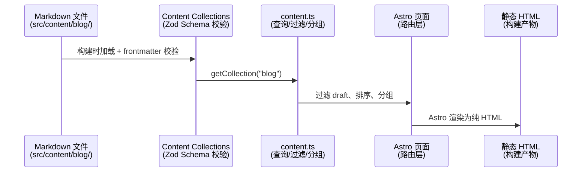

# 博客核心骨架 — 技术设计文档

## 1. 设计概要

**功能描述**：搭建博客六大页面（首页、文章详情、分类、标签、归档、关于），深色/浅色主题切换，响应式布局，自动部署。

**影响范围**：`src/pages/`、`src/components/`、`src/layouts/`、`src/utils/`、`src/content.config.ts`、`astro.config.mjs`

**技术难点**：无 — 纯静态展示型功能，无复杂交互逻辑

**外部依赖**：GitHub Actions + GitHub Pages（已配置）

---

## 2. 架构概览

本项目是 Astro 纯静态站点，数据流极为简单：



所有页面在构建时预渲染，运行时零 JS（除主题切换按钮这一个 Preact Island）。

---

## 3. 数据层设计

### 3.1 Content Schema 调整

**文件**：`src/content.config.ts`

```ts
// 当前 Schema（需修改）
schema: z.object({
  title: z.string().min(1).max(100),
  date: z.date(),
  updated: z.date().optional(),
  category: z.string().min(1),           // ❌ 必填 → 改为可选
  tags: z.array(z.string()).default([]),
  description: z.string().min(1).max(300),
  draft: z.boolean().default(false),
})

// 目标 Schema
schema: z.object({
  title: z.string().min(1).max(100),
  date: z.date(),
  updated: z.date().optional(),
  category: z.string().default("未分类"),  // ✅ 可选，默认"未分类"
  tags: z.array(z.string()).default([]),
  description: z.string().min(1).max(300),
  draft: z.boolean().default(false),
})
```

→ AC-017, AC-025：category 改为可选 + 默认值"未分类"，未指定分类的文章自动归入"未分类"

### 3.2 关于页数据

**文件**：`src/content/about.md`（新建，非 Content Collection，通过直接 import 加载）

```markdown
---
title: "关于"
---

## 关于我
...

## 关于这座数字花园
...
```

`src/pages/about.astro` 中通过 `import { Content } from "../content/about.md"` 直接渲染。

→ AC-007

### 3.3 站点配置分离 (CR-001)

用户可编辑的站点配置从 `constants.ts` 中分离到 `src/site.config.ts`，让非开发者也能安全修改。

**文件**：`src/site.config.ts`（新建）

```ts
export const siteConfig = {
  avatar: "/images/avatar.webp",  // 头像路径，用户替换 public/ 下的文件或修改此路径
  bio: "后端 / 全栈开发者...",      // 首页简介
  author: "Author",
};
```

**文件**：`src/utils/constants.ts`（修改）

```ts
import { siteConfig } from "../site.config";
export const SITE_AVATAR = siteConfig.avatar;
export const SITE_BIO = siteConfig.bio;
export const SITE_AUTHOR = siteConfig.author;
```

→ AC-002, AC-027

### 3.4 日期格式化调整

**文件**：`src/utils/date.ts`

```ts
// 当前：formatDate 返回 zh-CN 格式 → "2026/05/10"
// 改为：YYYY-MM-DD 格式 → "2026-05-10"
export function formatDate(date: Date): string {
  const y = date.getFullYear();
  const m = String(date.getMonth() + 1).padStart(2, "0");
  const d = String(date.getDate()).padStart(2, "0");
  return `${y}-${m}-${d}`;
}
```

→ AC-026, BR-004

---

## 4. 路由设计

遵循 Astro 文件路由约定，所有页面位于 `src/pages/` 下：

| URL | 文件 | 用途 | 对应 AC |
|-----|------|------|---------|
| `/` | `index.astro` | 首页：头像简介 + 文章列表 | AC-001, AC-002 |
| `/blog/<slug>/` | `blog/[...slug].astro` | 文章详情 | AC-003 |
| `/blog/category/` | `blog/category/index.astro` | **新增**：所有分类总览 | AC-004 |
| `/blog/category/<name>/` | `blog/category/[category].astro` | 某分类下文章列表 | AC-004 |
| `/blog/tag/` | `blog/tag/index.astro` | **新增**：所有标签总览 | AC-005 |
| `/blog/tag/<name>/` | `blog/tag/[tag].astro` | 某标签下文章列表 | AC-005 |
| `/archive/` | `archive.astro` | 按年月归档 | AC-006 |
| `/about/` | `about.astro` | 关于页（读取 MD） | AC-007 |
| `/friends/` | `friends.astro` | 友链（已有，不变） | — |
| `/404/` | `404.astro` | 404 页面 | AC-023 |

### 4.1 新增路由

**`blog/category/index.astro`**：查询 `getAllCategories()` → 渲染 `<CategoryList>` 组件。

**`blog/tag/index.astro`**：查询 `getAllTags()` → 渲染 `<TagCloud>` 组件。

→ AC-004, AC-005

---

## 5. 组件设计

### 5.1 Header 改造

**文件**：`src/components/Header.astro`

改动项：
1. **挂载 ThemeToggle** — 在导航右侧添加 `<ThemeToggle client:load />`
2. **添加分类/标签导航链接** — navItems 增加「分类」→ `/blog/category/`，「标签」→ `/blog/tag/`
3. **移动端汉堡菜单** — 桌面端横向排列，移动端（<768px）收缩为汉堡按钮，点击展开垂直菜单。使用内联 `<script>` 实现（约 10 行 JS），避免为此引入额外的 Preact Island。
4. **头像全站展示（CR-001）** — 在站点标题左侧添加 ``，桌面端和移动端均可见。头像缺失时 `onerror` 替换为占位文字。

→ AC-008, AC-009, AC-010, AC-012, AC-028, AC-029

### 5.2 首页 Hero 区域

**文件**：`src/pages/index.astro`

在 PostList 上方新增：

```
┌─────────────────────────────────────┐
│  [头像]                              │
│  作者简介文字                         │
└─────────────────────────────────────┘
```

头像和简介从 `constants.ts` 读取。

→ AC-001, AC-002

### 5.3 PostCard 标题截断

**文件**：`src/components/PostCard.astro`

标题添加 `line-clamp-1` 或 `truncate` Tailwind 类。

→ AC-020

### 5.4 图片缺失占位

在文章渲染层（`BlogPostLayout.astro`）添加全局 `` 错误处理——通过 `onerror` 替换为占位文字。使用内联 `<script>` 实现：

```js
document.querySelectorAll('article img').forEach(img => {
  img.addEventListener('error', () => {
    img.replaceWith(Object.assign(document.createElement('span'), {
      textContent: '图片未找到',
      className: 'text-gray-400 italic'
    }));
  });
});
```

→ AC-019

### 5.5 空分类/标签状态

**文件**：`blog/category/[category].astro`、`blog/tag/[tag].astro`

当 `posts.length === 0` 时，显示友好提示而非仅靠 PostList 的空状态。

→ AC-016

---

## 6. 构建配置

### 6.1 Shiki 代码高亮

**文件**：`astro.config.mjs`

```js
export default defineConfig({
  // ...现有配置
  markdown: {
    shikiConfig: {
      theme: "github-dark-dimmed",
      wrap: true,  // 长行自动换行（配合 CSS overflow-x:auto）
    },
  },
});
```

→ AC-003（代码块语法高亮）、AC-021（长行不撑破布局）

### 6.2 Slug 唯一性校验

**文件**：`src/pages/blog/[...slug].astro`

在 `getStaticPaths()` 中添加重复 slug 检测：

```ts
export async function getStaticPaths() {
  const posts = await getCollection("blog");
  const seen = new Map<string, string>();
  for (const p of posts) {
    if (seen.has(p.slug)) {
      throw new Error(`Slug 重复: "${p.slug}" 出现在多个文件中`);
    }
    seen.set(p.slug, p.id);
  }
  // ...
}
```

→ AC-024, BR-001

---

## 7. 现有代码改动汇总

| 模块 / 文件 | 改动内容 | 原因 | 对应 AC |
|-------------|---------|------|---------|
| `src/site.config.ts` | **新建** | 用户可编辑的站点配置文件（头像、简介、作者名）| AC-027 |
| `src/utils/constants.ts` | 新增 SITE_AVATAR, SITE_BIO（从 site.config 读取）| 首页 Hero 区显示作者信息 | AC-002, AC-027 |
| `src/utils/date.ts` | formatDate 改为 YYYY-MM-DD | 对齐需求中的日期格式规范 | AC-026 |
| `src/content.config.ts` | category 改为可选 + 默认值 | 未分类文章不阻塞构建 | AC-017, AC-025 |
| `src/content/about.md` | 新建 | 关于页内容独立为 MD，方便编辑 | AC-007 |
| `src/pages/index.astro` | 新增 Hero 区域 | 首页显示作者头像简介 | AC-001, AC-002 |
| `src/pages/about.astro` | 改为读取 about.md | 内容与代码分离 | AC-007 |
| `src/pages/blog/category/index.astro` | **新建** | 所有分类总览页 | AC-004 |
| `src/pages/blog/tag/index.astro` | **新建** | 所有标签总览页 | AC-005 |
| `src/pages/blog/category/[category].astro` | 增加空状态处理 | posts=0 时友好提示 | AC-016 |
| `src/pages/blog/tag/[tag].astro` | 增加空状态处理 | posts=0 时友好提示 | AC-016 |
| `src/pages/blog/[...slug].astro` | getStaticPaths 增加 slug 去重校验 | 确保 BR-001 | AC-024 |
| `src/components/Header.astro` | 挂载 ThemeToggle + 汉堡菜单 + 新导航项 + 头像展示 | 主题切换入口 + 响应式 + 全站头像 | AC-008, AC-009, AC-010, AC-012, AC-028, AC-029 |
| `src/components/PostCard.astro` | 标题添加 truncate | 长标题不撑破布局 | AC-020 |
| `src/layouts/BlogPostLayout.astro` | 添加图片错误处理脚本 | 图片缺失时显示占位文字 | AC-019 |
| `astro.config.mjs` | 添加 Shiki 代码高亮配置 | 代码块语法高亮 | AC-003 |

---

## 8. 技术决策

### 移动端菜单：内联 JS vs Preact Island

- **A**: Preact Island — 与 ThemeToggle 同技术栈，状态管理方便
- **B**: 内联 `<script>` — 零依赖，约 10 行代码，体积极小

**结论**：选 B。汉堡菜单逻辑极简（切换 class + 关闭回调），不值得引入 Preact 组件的运行时开销。

### 关于页：Content Collection vs 直接 import

- **A**: 建立 `src/content/about/` Collection — 需定义 Schema，可扩展多篇"页面"
- **B**: 直接 `import { Content } from '../content/about.md'` — 零配置，单个文件足够

**结论**：选 B。只有一篇关于页，Collection 的 Schema 定义和查询开销没有收益。

---

## 9. AC 覆盖总表

| AC 编号 | 验收标准概述 | 实现位置 |
|---------|-------------|---------|
| AC-001 | 首页文章列表 | `src/pages/index.astro` → `<PostList>` |
| AC-002 | 首页个人简介 | `src/pages/index.astro` Hero 区 + `constants.ts` |
| AC-003 | 文章 Markdown 渲染 + 代码高亮 | `blog/[...slug].astro` + `BlogPostLayout` + `astro.config.mjs` Shiki 配置 |
| AC-004 | 分类列表 + 分类下文章 | `blog/category/index.astro` (新增) + `[category].astro` |
| AC-005 | 标签列表 + 标签下文章 | `blog/tag/index.astro` (新增) + `[tag].astro` |
| AC-006 | 归档页按年月分组 | `archive.astro` (已有) |
| AC-007 | 关于页渲染 | `about.astro` + `src/content/about.md` (新增) |
| AC-008 | 首次访问跟随系统主题 | `BaseLayout.astro` 内联 `<script>` (已有) |
| AC-009 | 手动切换并记忆 | `ThemeToggle.tsx` + `Header.astro` 挂载 |
| AC-010 | 移动端响应式 | `Header.astro` 汉堡菜单 + Tailwind 断点 |
| AC-011 | 平板端响应式 | Tailwind `sm:` / `md:` / `lg:` 断点 + `BaseLayout` 的 `max-w-4xl` |
| AC-012 | 全局导航 | `Header.astro` navItems (含分类/标签/归档/关于) + ThemeToggle |
| AC-013 | Sitemap 自动生成 | `@astrojs/sitemap` (已在 `astro.config.mjs` 集成) |
| AC-014 | 自动部署 | `.github/workflows/deploy.yml` (已有) |
| AC-015 | 空文章状态 | `PostList.astro` — 已有 `posts.length === 0` 分支 |
| AC-016 | 空分类/标签 | `[category].astro` / `[tag].astro` — 增加空状态文案 |
| AC-017 | 未分类文章 | `content.config.ts` — `category` 默认值 `"未分类"` |
| AC-018 | 无标签文章 | `BlogPostLayout.astro` — 已有 `tags.length > 0` 条件渲染 |
| AC-019 | 图片缺失占位 | `BlogPostLayout.astro` — 内联 `<script>` onerror |
| AC-020 | 超长标题截断 | `PostCard.astro` — `truncate` tailwind class |
| AC-021 | 代码块长行滚动 | `global.css` — 已有 `overflow-x: auto` + Shiki `wrap: true` |
| AC-022 | Frontmatter 校验失败 | `content.config.ts` Zod schema — Astro 构建时自动校验并报错 |
| AC-023 | 404 页面 | `404.astro` — 已有 |
| AC-024 | Slug 唯一性 | `blog/[...slug].astro` — `getStaticPaths()` 中重复检测 |
| AC-025 | 必须有分类 → "未分类" | `content.config.ts` — 同 AC-017 |
| AC-026 | 日期格式 YYYY-MM-DD | `date.ts` — `formatDate` 重构 |

---

## 附录：变更记录

| 日期 | 变更内容 | 原因 |
|------|---------|------|
| 2026-05-10 | 初始版本 | — |
| 2026-05-10 | CR-001：3.3 节站点配置分离、5.1 节 Header 头像展示 | 头像路径从硬编码改为配置文件驱动，Header 全站展示头像 |
